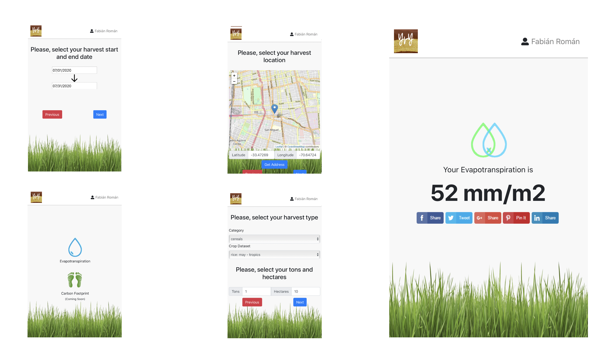
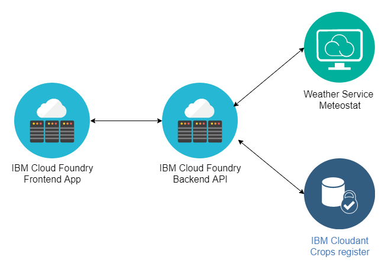
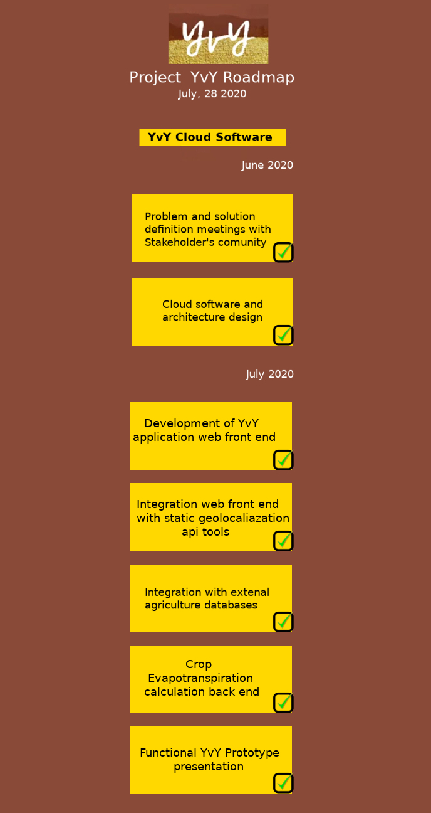
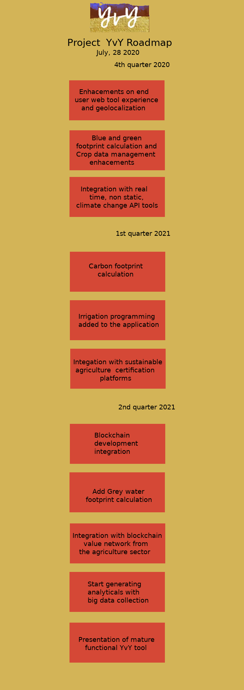

# Project YvY

## Short description
Comprehensive solution for sustainable and climate-smart agriculture.

### What's the problem?
Fresh water is a limited resource and climate change on the other hand is a global and growing threat. Measuring the impact of agriculture on the water resource and its contribution to climate change is essential. And it is necessary to provide farmers with an easy-to-use tool to measure these impacts.

### The idea
Project YvY is a web application that allows to measure the water footprint using updated databases on cultivation and climate, interacting with weather services and the FAO56 dataset so that the producer can upload the necessary data in a simple way and obtain the footprint for certification through the application.
The application will also measure the carbon footprint of agriculture and can be integrated into blockchain of the food sector. This will give better visibility and traceability of the product, encouraging the incorporation of good practices. The web application and cloud information will enable data analytics on carbon and water in agriculture, integrating with sustainable and / or regenerative agriculture certification systems.

### What we built
This prototype is a web application built on IBM Cloud using Cloud Foundry runtimes to host the frontend and backend, IBM App ID for authentication and Cloudant as the database. In addition, the application is integrated with a weather API to extract historical weather data. Currently, the web application allows farmers to calculate crop evapotranspiration according to input data such as location, date, crop type, along with agroclimatic data provided by official sources and maintained by the team. 

The end result will be a simple and friendly web application that will contain data provided by Cropwat and other agroclimatic databases, providing farmers a tool for calculating water and carbon footprints as easy as possible.

We expect to enhance the solution using advanced analytics and AI to better understand each farmer data and predict future outcomes. Also, we are already looking to join blockchain networks like IBM Food Trust as a relevant participant in the alimentary supply chain.

### Potential impact
Project YvY hopes to reach farmers in LA and the Caribbean who do not have the possibility of measuring these footprints and also large agricultural companies that are transforming their production models to improve the management of footprints in order to have the possibility of joining value chains in the food sector, serving the growing demand of conscious consumers who are also beneficiaries of this application since they will have the footprint information of the products they consume.

## Application Screenshots

## The architecture

## Project Roadmap

# Live demo
[Project YvY](https://waterfootprint-dev.mybluemix.net)

* username: test@yvy.org
* password: test1234

# Built with

* Cloud Foundry runtimes
* IBM Cloudant NoSQL DB
* IBM App ID
